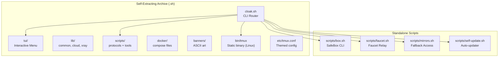

# Cloak — Offline Desktop Client

Cloak bundles the complete Vany censorship bypass suite into a self-extracting shell archive. Download once, run anywhere — no internet required for local tools and TUI.

## Install

### Linux / macOS

```bash
# Download the archive for your platform from GitHub Releases
chmod +x cloak-linux-amd64.sh
./cloak-linux-amd64.sh

# Cloak installs to ~/.cloak and symlinks 'cloak' to your PATH
cloak help
```

### Windows

Extract `cloak-windows-amd64.zip` and double-click `cloak.bat`. Requires [WSL](https://learn.microsoft.com/en-us/windows/wsl/install).

### Platforms

| Archive | Platform |
|---------|----------|
| `cloak-linux-amd64.sh` | Linux x86_64 |
| `cloak-linux-arm64.sh` | Linux ARM64 (RPi, Oracle) |
| `cloak-darwin-amd64.sh` | macOS Intel |
| `cloak-darwin-arm64.sh` | macOS Apple Silicon |
| `cloak-windows-amd64.zip` | Windows 10/11 (via WSL) |

## Usage

```bash
cloak                         # Launch TUI (interactive menu)
cloak tmux                    # Launch inside themed tmux session
cloak help                    # Show all commands
```

### Server Management (requires root + VPS)

```bash
sudo cloak install reality    # Install protocol
sudo cloak add reality alice  # Add user
cloak links alice             # Show connection configs
cloak status                  # Container status
```

### Client Tools (run from restricted network)

```bash
cloak cfray                   # Find clean Cloudflare IPs
cloak findns                  # Discover accessible DNS resolvers
cloak tracer                  # IP / ISP / ASN lookup
cloak speedtest               # Bandwidth test
```

### Encrypted Dead-Drop (SafeBox)

```bash
cloak box                     # Interactive: create or open a box
cloak box create              # Create encrypted box
cloak box ABCD1234            # Open box by ID
```

### Network Relay (Faucet)

```bash
cloak faucet                  # Start relay node -> free VPN link
```

### Fallback Access Methods

```bash
cloak mirrors                 # Show all ways to reach vany.sh
cloak mirrors --test          # Test which methods work from your network
cloak mirrors --rescue        # Auto-try every method until one works
```

### Self-Update

```bash
cloak update                  # Update to latest release
cloak update --check          # Check only, don't install
cloak version                 # Current version
```

## Architecture



## What Works Offline

| Feature | Offline | Online |
|---------|---------|--------|
| TUI menu + navigation | Yes | Yes |
| Protocol install wizard | Yes (on VPS) | Yes |
| User management | Yes (on VPS) | Yes |
| Container status | Yes (on VPS) | Yes |
| cfray / findns / tracer / speedtest | Partial | Yes |
| SafeBox (create/open) | No | Yes |
| Faucet relay | No | Yes |
| Mirrors (show methods) | Yes | Yes |
| Mirrors (test/rescue) | No | Yes |
| Self-update | No | Yes |

## tmux Integration

Cloak bundles a static tmux binary on Linux. On macOS, install tmux via `brew install tmux`.

```bash
cloak tmux                    # Launch in themed tmux session
```

Keybindings inside the tmux session:

| Key | Action |
|-----|--------|
| `Ctrl+N` | New window |
| `Ctrl+T` | Window tree selector |
| `Alt+Arrow` | Switch pane |
| `Shift+Arrow` | Switch window |
| `Ctrl+B, \|` | Split horizontal |
| `Ctrl+B, -` | Split vertical |

## Build from Source

```bash
# Requires: makeself (brew install makeself / apt install makeself)
bash build/cloak-build.sh linux-amd64 1.0.0
# Output: dist/cloak-linux-amd64.sh
```

## CI/CD

Push a `cloak-v*` tag to trigger the build pipeline:

```bash
git tag cloak-v1.0.0
git push origin cloak-v1.0.0
```

GitHub Actions builds all 5 platform archives and creates a GitHub Release with download links.

## Uninstall

```bash
cloak uninstall
# Removes ~/.cloak and the 'cloak' symlink
```
